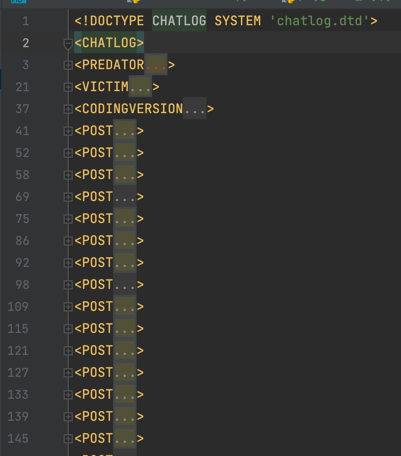
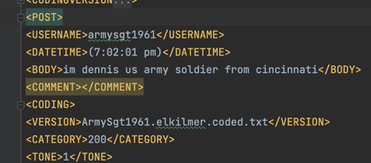

The final project is a combination of HW2 & HW3.

**Definition of HW2:**

Task #2 - Short text predator detection
This is the first part of two in your mini project which is 80% of your final grade (this part is 50% and the next one is 30%).

As opposed to previous task - this one is very similar to the ones we encounter in real life (i.e., the goal is clear, but everything else is obscure). 

Your goal is building an AI-powered predator detector that will save youth (victims) from threats and hazards of online attacks (the most concerning one is pedophiles). 

In this task - I am your customer. That means, I have raised the business need. Your job is proposing a solution with high validity such that I'll understand your solutions method and capabilities (performance). Keep in mind - your customer has some experience in D.S and cyber security. You have 2 months to create a proposal that will convince your customer to invest in your solution. He will review your repots, and accordingly decide whether he believes your solution can work and how is it compared to others. Only one solution will be chosen.

Currently, your customer have shared with you a corpus of predator- victim conversations he gathered (originally from perverted-justice.com). This should be used as your starting point in the research/proposal setup. Eventually, your customer looks for a proposal to implement in a chat framework, where anyone can contact anyone else with no restrictions, and the details of the chat users were not confirmed (i.e., one can write any age, location, interests as he wish).

Since this tasks goal is focusing on real-life challenges, there is no specific structure or guidelines you should follow. Your goal is convincing your customer that your proposed solution satisfied his needs (please note that users needs were not really defined - you can help him). Note that you have already done one task in your past, this may be used as potential baseline.

Your delivery should include:

Report - a pdf document with complete review of all your work. 
Code (may be in any form (colab, .py, Jupyter). Please note that I will not be reviewing your code results - hence, if you have anything you wish to present in your report - make sure you copy it.
What am I looking for?

Problem definition - make it clear 
Data handling (note that the data your customer shared with has no benign data)
Simplicity - should be easy to implement and understand
Deployability - address this issue - eventually it should work not only in theory
Profound report with comprehensive documentation 
Future work and discussion - where this project can lead us to? build-up for your next clients project
Let your customer know about your thoughts, limitations and restrictions. 
You are free to use any package, tool, service. No limitations.

**Definition of HW3:**

Task #3 - Model Watermarking
Following task #2 – malicious predator detection using short text topic modeling, the company owners decided to deploy their model on edge devices (rather than on BE) to reduce the response time which is a critical factor in the case of real attack

Though having a great idea, if they change the deployment method, they risk themselves in a model theft as they cannot know their customers motives and cannot control their customers actions.

Accordingly, they reached out to you – their model suppliers with a request – adding a watermarking ability for their deployed model.

The motivations for their decision were:

Watermarking is commonly used for ownership identification, and in the case, someone steals their model, they will be able proving in the court of law that they are the real owners of the model
Once an adversary knows something is watermarked – the chances for him to steal it and use it publicly reduces significantly
The watermarking should address two attack/steal vectors:

Model stealing – i.e., the adversary was able stealing the model "as is"
Model stealing by "reverse engineering" – the adversary was able re-building a model using Blackbox sampling
Please note that you must address the three main factors of watermarking while proposing your solution:

Capacity – The size/amount of watermarks
Robustness/Security – Resilience to changes and/or adversarial attacks for watermark removal
Imperceptibility – Can someone know/understand there is a watermark if he was not told so? Please note that as opposed to steganography, in many cases watermark is perceptible on purpose
You may use any watermark and/or steganography embedding technique.

As always – try to make it as simple as possible – we think and design production oriented, not theoretical "works on paper" products

The implementation should be conducted on the model you deliver on your second task.

In the case you are not able conducting all your experiments on real data, you may add more suggestions without implementation (make sure they are good – adding suggestions with no proper reasoning will not be appreciated)

**Additional info I added**

Example of the XML format of a conversation:

what a single post looks like:

Additional Reading material:

https://paperswithcode.com/dataset/panc   
leads to:
https://gitlab.com/early-sexual-predator-detection/eSPD-datasets
and can be also reached from:
https://aclanthology.org/2021.acl-long.386/
https://early-sexual-predator-detection.gitlab.io/

